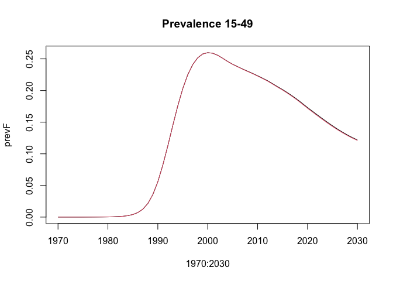
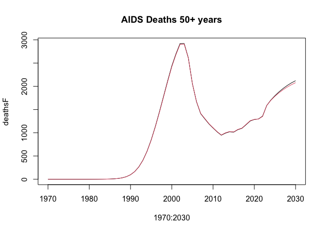

<!-- README.md is generated from README.Rmd. Please edit that file -->

# frogger

<!-- badges: start -->

[](https://www.repostatus.org/#wip)
[](https://github.com/mrc-ide/frogger/actions/workflows/R-CMD-check.yaml)
<!-- badges: end -->

Leapfrog is a multistate population projection model for demographic and
HIV epidemic estimation.

The name *leapfrog* is in honor of
[Professor](https://iussp.org/en/basia-zaba-1949-2018) Basia
[Zaba](https://translate.google.co.uk/?sl=pl&tl=en&text=Zaba&op=translate).

## Installation

You can install the development version of frogger from
[GitHub](https://github.com/) with:

``` r
# install.packages("remotes")
remotes::install_github("mrc-ide/frogger")
```

## Simulation model

The simulation model is implemented in a header-only C++ library located
in [`inst/include/frogger.hpp`](inst/include/frogger.hpp). This location
allows the C++ code to be imported in other R packages via specifying
`LinkingTo: leapfrog` in the `DESCRIPTION` file.

The simulation model is callable in R via a wrapper function
`run_model()` created with [Rcpp](https://www.rcpp.org).

You can control how the simulation model is run with the following
arguments:

- `run_hiv_simulation` which is `TRUE` by default. Set to `FALSE` to
  turn off the HIV simulation and run only the demographic projection.
- `hiv_age_stratification` which must be “coarse” or “full”. Coarse is
  run with 5-year age groups and full with single year ages.
- `run_child_model` which is `FALSE` by default. Set to `TRUE` to run
  the child portion of the model.

## Example

The file `pjnz/bwa_aim-adult-art-no-special-elig_v6.13_2022-04-18.PJNZ`
contains an example Spectrum file constructed from default country data
for Botswana with Spectrum (April 2022).

Prepare model inputs.

``` r
library(frogger)

pjnz <- system.file("pjnz/bwa_aim-adult-art-no-special-elig_v6.13_2022-04-18.PJNZ",
                    package = "frogger", mustWork = TRUE)

parameters <- prepare_leapfrog_parameters(pjnz)
```

Simulate adult ‘full’ age group (single-year age) and ‘coarse’ age group
(collapsed age groups) models from 1970 to 2030 with 10 HIV time steps
per year.

``` r
lsimF <- run_model(parameters, "HivFullAgeStratification", 1970:2030)
lsimC <- run_model(parameters, "HivCoarseAgeStratification", 1970:2030)
```

Compare the HIV prevalence age 15-49 years and AIDS deaths 50+ years.
Deaths 50+ years are to show some noticeable divergence between the
`"full"` and `"coarse"` age group simulations.

``` r
prevF <- colSums(lsimF$p_hiv_pop[16:50,,],,2) / colSums(lsimF$p_total_pop[16:50,,],,2)
prevC <- colSums(lsimC$p_hiv_pop[16:50,,],,2) / colSums(lsimC$p_total_pop[16:50,,],,2)

deathsF <- colSums(lsimF$p_hiv_deaths[51:81,,],,2)
deathsC <- colSums(lsimC$p_hiv_deaths[51:81,,],,2)

plot(1970:2030, prevF, type = "l", main = "Prevalence 15-49")
lines(1970:2030, prevC, col = 2)
```



``` r

plot(1970:2030, deathsF, type = "l", main = "AIDS Deaths 50+ years")
lines(1970:2030, deathsC, col = 2)
```



## Benchmarking

Install the package and then run the benchmarking script
`./scripts/benchmark`

## lint

Lint R code with `lintr`

``` r
lintr::lint_package()
```

Lint C++ code with [cpplint](https://github.com/cpplint/cpplint)

``` console
cpplint inst/include/*
```

## Code design

### Simulation model

The simulation model is implemented as templated C++ code in
`inst/include/frogger.hpp`. This is so the simulation model may be
developed as a standalone C++ library that can be called by other
software without requiring R-specific code features. The code uses
header-only open source libraries to maximize portability.

### Code generation

To change what parameters can be passed in from `R` or the structure of
`Intermediate`, `State` or `OutputState`, please modify json files
[here](./cpp_generation/modelSchemas/).

Then to run code generation follow
[cpp_generation/README.md](./cpp_generation/README.md)

### R functions

The file `src/frogger.cpp` contains R wrapper functions for the model
simulation via [Rcpp](http://dirk.eddelbuettel.com/code/rcpp.html) and
[RcppEigen](http://dirk.eddelbuettel.com/code/rcpp.eigen.html).

## Development notes

### Testing

There is some pre-prepared test data available to make tests run faster.
This is generated and saved `./scripts/create_test_data.R`.

We also have some separate data written out in a generic format which
can be read to test the model directly from C++. This is in
`inst/standalone_model/data` in zipped files.

If this is your first time running you will need to unzip the standalone
test data

    ./inst/standalone_model/extract_data

If you want to update the test data, it should be updated in the
`./scripts/create_test_data.R` script so that we know how it was created
and we can do it again fairly easily. Steps are 1. Update the script and
generate the test data 1. Update the standalone data which is built from
this `./scripts/update_standalone_data`. You might need to add a new
mapping from R to serialized name if you are adding new input data 1.
Unzip this for automated tests `./inst/standalone_model/extract_data`

### Simulation model

- The model was implemented using *Eigen::Tensor* containers. These were
  preferred for several reasons:
  - Benchmarking found they were slighlty more efficient than
    *boost::multi_array*.
  - Column-major indexing in the same order as R
  - Other statistical packages (e.g. TMB, Stan) rely heavily on *Eigen*
    so using *Eigen* containers slims the dependencies.

### TODO

- Restructuring the model code to identify more common code
  - There are examples like general demographic projection and hiv
    population demographic projection which are running similar
    processes like ageing, non HIV mortality, migration. We should be
    able to write a function for e.g. ageing which we can run on each of
    our population matrices. Even for the HIV and ART stratified we can
    add overloaded function to work with higher dimension data
- Add a test that checks that no `double`s are used in `inst/include`
  dir. We should be using templated `real_type` for TMB
- Add a broad level overview of the algorithm - is there a diagram
  available?
- Convert string flags to the model to enums if we need to switch on
  them in several places. This should make it easier to reason about in
  C++ world and isolate the string checking to a single place
- Previously `hiv_negative_pop` was fixed size by having dimensions
  specified by template, how much does this speed up the code? Is there
  a better way to do this?
- Tidy up confusing looping see
  <https://github.com/mrc-ide/frogger/pull/7#discussion_r1217847753>
- Add R casting helpers which return better errors than Rcpp see
  <https://github.com/mrc-ide/frogger/pull/7#discussion_r1217884684>
- Add a helper to do 0 to base 1 conversion and check upper bounds see
  <https://github.com/mrc-ide/frogger/pull/7#discussion_r1217888684>
- Review what we pass as parameters - can some of these be computed in
  the struct ctor?
  e.g. <https://github.com/mrc-ide/frogger/pull/7#discussion_r1217890466>
- Refactor `OutputState` to take a struct of state-space dimensions
  instead of unpacking the subset of parameters we need. See
  <https://github.com/mrc-ide/frogger/pull/12#discussion_r1245170775>

## License

MIT © Imperial College of Science, Technology and Medicine
